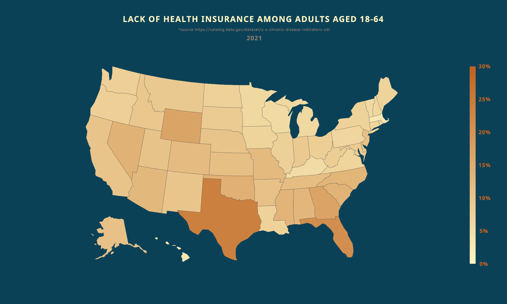
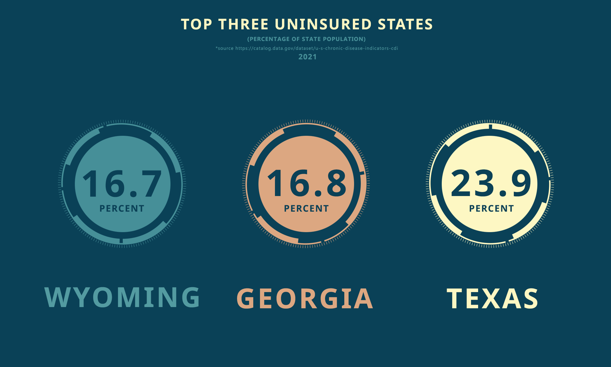
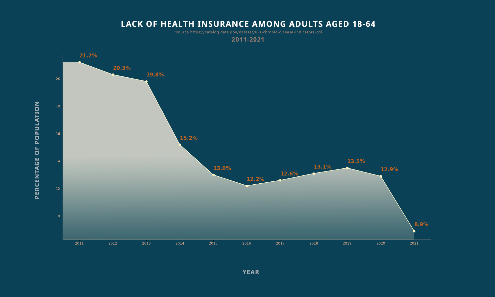
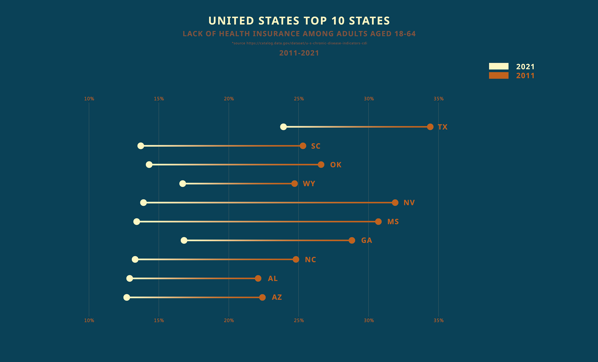

<strong>ABOUT</strong> 
 
The United States has experienced a noteworthy decline in the number of uninsured citizens over the past decade. Specifically, between 2011 and 2021, the proportion of individuals without health insurance plummeted from over 21 percent to approximately 8.9 percent. While certain states have lagged behind in this regard, the overall trend is encouraging.

It is worth noting that there were some fluctuations in this trend over the years. Following a change in administration in 2016 and some associated policy shifts, the number of uninsured Americans did experience a temporary increase. However, subsequent changes in 2020 have led to a renewed downward trajectory. It'll be interesting to see how will unisured numbers look in the upcoming years, but the data suggests that a growing number of individuals have access to health insurance coverage.

You can find this data sheet at https://catalog.data.gov/dataset/u-s-chronic-disease-indicators-cdi

<strong>HOW TO NAVIGATE THIS REPO?</strong> 
 
This is a simple repo. The assets folder holds all the graphs. The chartmakers folder contains code that help make the charts. The rest is there to sort the data. 

<strong>WHAT HAVE I COVERED?</strong> 
 
1. USA 'heat' map showing uninsured population
2. Line chart displaying uninsured percentages from 2011 to 2021
3. Top 10 states for 2021 (with valid data) among uninsured and how their numbers compare to 2011
4. Top three uninsured states with percentage of uninsured population

<strong>SCREENSHOTS</strong>

